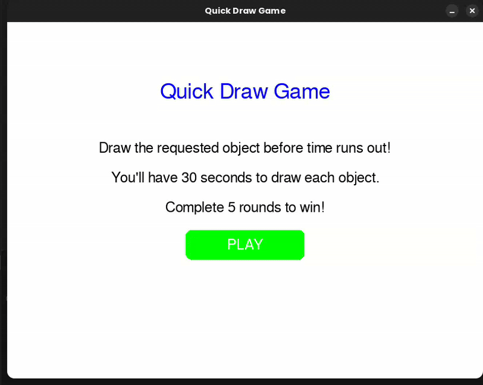

# Project Title
Identify Hand-Drawn Illustrations

## Description
- We build a CNN model to recognize hand-drawn grayscale images.
- The dataset is sourced from Google's Quick, Draw! project.
- For simplicity, we use only 20 classes for training.

## Getting Started

### Dependencies
- OS: Linux 22.04.5 LTS or higher
- Python 3.10.12 or higher
- NumPy 2.1.3 or higher
- PyTorch 2.6.0 or higher
- tensorflow 2.19.0 or higher
- OpenCV 4.11.0.86 or higher
- tqdm 4.67.1 or higher
- scikit-learn 1.6.1 or higher
- pygame 2.6.1 or higher

### Downloading the Dataset
- Link to the dataset: [Quick, Draw! Dataset](https://console.cloud.google.com/storage/browser/quickdraw_dataset/full/numpy_bitmap;tab=objects?pageState=(%22StorageObjectListTable%22:(%22f%22:%22%255B%255D%22))&prefix=&forceOnObjectsSortingFiltering=false&inv=1&invt=AbrzMQ)
- Download 20 arbitrary classes.

### Executing the Program
1. Install PyTorch (if not already installed):
```
pip install torch
```
2. Install tensorflow (if not already installed):
```
pip install tensorflow
```
3. Install NumPy (if not already installed):
```
pip install numpy
```
4. Install OpenCV (if not already installed):
```
pip install opencv-python
```
5. Install tqdm (if not already installed):
```
pip install tqdm
```
6. Install scikit-learn (if not already installed):
```
pip install scikit-learn
```
7. Install pygame (if not already installed):
```
pip install pygame
```

8. Run `train.py` to train the model. Remember to check for parameters before running.
9. Check for model path before running `main.py`
10. Run `main.py` and enjoy the game!.

### Demo video
